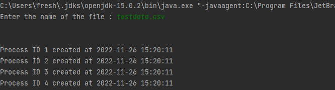
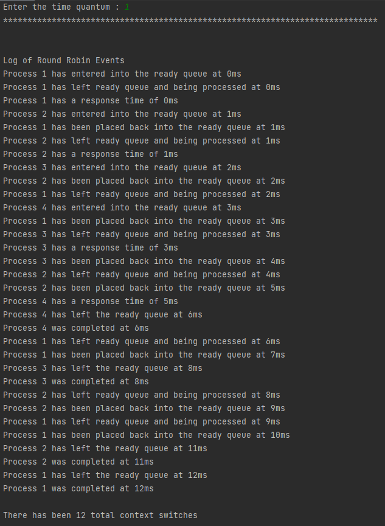
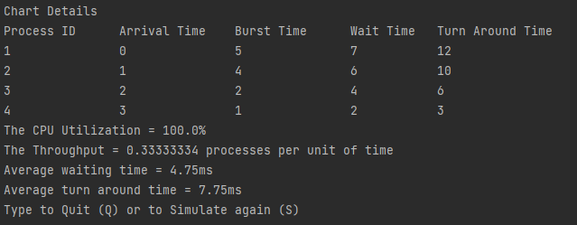
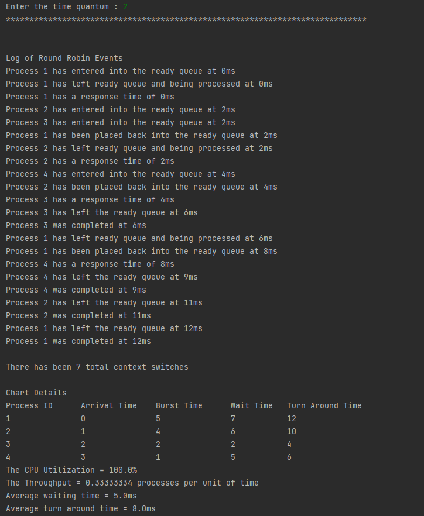
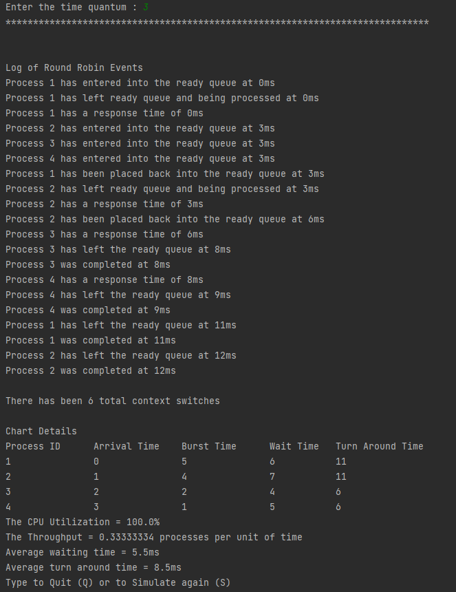
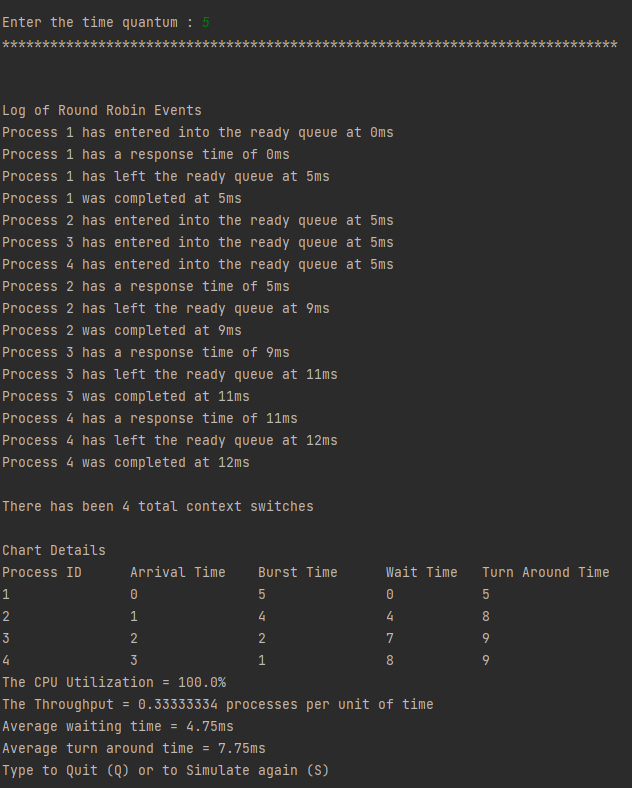
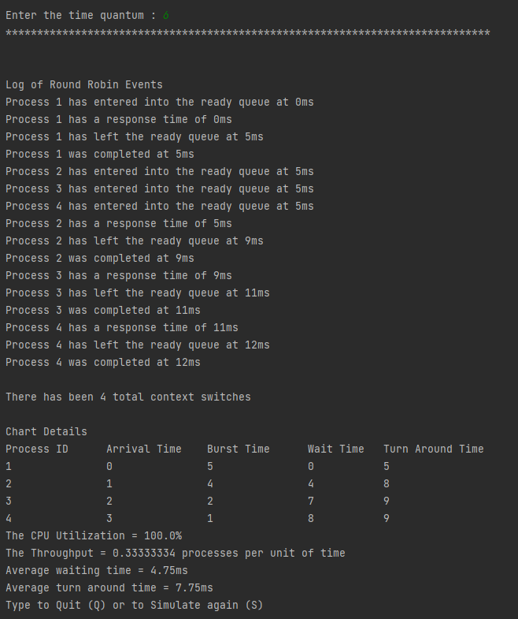

# CPU Scheduling Project 
By: Rasheed Martin

CSCI 330

Operating Systems

The objective is to create a program that simulates 
Round Robin CPU scheduling. 

## Program Requirements: 

>The program you will create is used to generate a schedule of processes. The
processes are stored in a plaintext file. The program accepts two parameters. The
first parameter is the path of the processes file. The second parameter is the time
quantum.
>
>
>Your simulation should include the following:
>- **Clock timestamps**:  all events for processes, such as creation time, completion time,
etc.
>
>- **Process Creator**: creates processes at arrival time
>- **CPU**: runs processes for a time slice (time quantum)
>- **Queue**: FIFO ready queue used by both the process creator and CPU
>- **Process Arrival Time**: arrival time of new processes into the ready queue
>- **Process Service Time**: amount of time required by the processes to complete execution
>- **Time Quantum**: time each process can spend in the CPU, before it is removed
>- **Context Switch**: number of times a process is switched
>
>Your program should also print out the following performance evaluation criteria:
>- CPU Utilization
>- Throughput
>- Average Waiting Time
>- Average Turnaround Time

## Background 

### CPU Scheduling

The process of choosing which process will use the CPU while another is waiting is known as CPU scheduling.
CPU schedulings' primary responsibility is to make sure that whenever the CPU is idle, the OS at least 
chooses one of the processes in the ready queue to be executed.
The CPU scheduler will conduct the selecting process.
One of the processes in memory that is prepared for execution is chosen. 

When numerous I/O binding processes are chosen by the long-term scheduler in multiprogramming, 
the CPU is typically idle.
Resource utilization must be improved for a program to be effective.

There may always be a danger of system failure if most operating systems change their status from performing to waiting.
Therefore, in order to maximize CPU use and prevent deadlock,
the OS must plan processes in order to reduce this surplus.

### Round Robin

The oldest and simplest scheduling algorithm is round-robin. The round-robin principle, in which each person gets an 
equal amount of something in turn, inspired the name of this method.
It is primarily employed for multitasking scheduling algorithms. This algorithmic approach aids in the execution of 
tasks without starving. 

It is the First come, First served CPU Scheduling technique with preemptive mode. The Round Robin CPU algorithm 
frequently emphasizes the Time Sharing method.
Because all processes receive a balanced CPU allocation, it is straightforward, simple to use, and starvation-free.
one of the most used techniques for CPU core scheduling. Because the processes are only allowed access to the CPU for 
a brief period of time, it is seen as preemptive.
Every process receives an equal amount of CPU time, therefore round-robin appears to be equitable. To the end of the 
ready queue is added the newly formed process. 

## Installation 

Download the zip file. Unzip the zip file. Using any java IDE and complier,place the folder into the project folder
that you want to run the program. 

## Running Program 

1. Upon running of the program, the program will ask you for two parameters. The first parameter will be 
asking for the name of the csv file that holds the data of the processes (pid, arrival, burst). 
You can either provide an absolute path or relative path assuming the csv file is in the project folder.
**Please note that you have to enter a file path that exists or the program will continue to ask 
until it gets a file path that exists**
2. The second parameter that the program will ask you are the time quantum that you 
would like the round robin to execute at. **Please note that this number has to be greater than 0 
or else you will be required to enter a valid input**
3. The program will provide you will a log of events of the round-robin algorithm including
   1. Time stamps 
   2. Response times,
   3. Completion time
   4. Total number of context switches. 
4. It will provide a chart of details such as
   1. Process Ids
   2. Arrival times
   3. Burst times,
   4. Waiting Times
   5. Turn Around Times. 
5. The program also analysis provides the 
   1. CPU Utilization 
   2. CPU Throughput
   3. Average Waiting Time
   4. Average Turn Around Time 

## Simulation 

>Upon running the program, you will be prompted to run enter the name of the csv file. If the file name is correct
the program will create the processes from the csv file and display confirmation with time stamps. 

>For our first simulation, we will run this program at a time quantum = 1. This image below shows you the 
log of the Round Robin events. It also provides the total number of context switches. 

>Continuing the first simulation at time quantum 1, the image shows the chart details. These chart details include
Process ID, Arrival Time, Burst Time, Wait Time, Turn Around Time, The CPU Utilization, The Throughput, 
the Average waiting time, and Average Turn Around Time. 

>This is an image of the second simulation at time quantum 2. The image shows the Log of Events and the Chart Details.

>This is an image of the third simulation at time quantum 3. The image shows the Log of Events and the Chart Details.

>This is an image of the fourth simulation at time quantum 4. The image shows the Log of Events and the Chart Details.

>This is an image of the fifth simulation at time quantum 5. The image shows the Log of Events and the Chart Details.

>This is an image of the sixth simulation at time quantum 6. The reason I did a 6th simulation 
> is to prove the disadvantage of a round-robin. 
> When the time quantum gets to large, the round robin turns into a First Come First Serve (FCFS). 
> The image shows the Log of Events and the Chart Details. 
> As you can see, all the data from the fifth simulation and the sixth simulation are the same. 

## Conclusion

This project was very informative on the operations of CPU Scheduling but specifically a Round Robin algorithm. 
I hope this simulation was very helpful and works to inform others :)